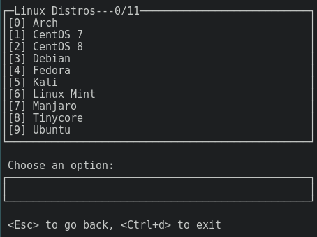
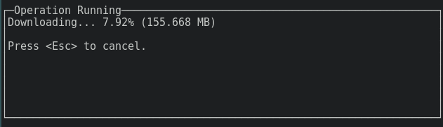

## Agenda

- Introduction
- u-root as a Build Tool
- Booting Kernels with kexec
- Understanding Bootloaders

# Introduction

## Recap: [LinuxBoot](https://www.linuxboot.org/)

> Let Linux do it

* Linux kernel provides device drivers and networking
* initramfs with utilities, bootloader, whatever you wish
* on top of vendor UEFI firmware: remove DXEs, build Linux with EFI stub

{ width=90% }

## u-root

A universal root filesystem

:::::::::::::: {.columns}
::: {.column width="42%"}
{ height=72% }
:::
::: {.column width="58%"}
- written in Golang, easily portable
- all open, meant for studying and understanding
- many small Unix-like tools
- offers various bootloaders
- tooling for single binary with multiple entry points like BusyBox


:::
::::::::::::::

[https://u-root.org/](https://u-root.org/)

# u-root as a Build Tool

## Building an initrd

The `u-root` command builds an initrd and can be given files, templates, and
additional Go sources to be built in.

```sh
u-root \
  -files files/rc.elv:.elvish/rc.elv \
  -files bootsplash.png \
  boot core
  github.com/u-root/u-root/cmds/exp/fbsplash
```

## Templates

A select few templates exist for common applications, such as core utilities and
boot utilities.

`templates.go`

```
/* ... */
        "boot": {
                "github.com/u-root/u-root/cmds/boot/*boot*",
        },
        // Absolutely everything, including experimental commands.
        "world": {
                "github.com/u-root/u-root/cmds/*/*",
        },
        // Core should be things you don't want to live without.
        "core": {
                "github.com/u-root/u-root/cmds/core/*",
        },
/* ... */
```

# Booting Kernels with kexec

## Prerequisites

`$ man kexec`

```txt
DESCRIPTION
   kexec is a system call that enables you to load and  boot  into
   another  kernel  from  the  currently  running  kernel.   kexec
   performs the function  of  the  boot  loader  from  within  the
   kernel.  The  primary difference between a standard system boot
   and a kexec boot is that the hardware  initialization  normally
   performed  by  the BIOS or firmware (depending on architecture)
   is not performed during a kexec boot. This has  the  effect  of
   reducing the time required for a reboot.

   Make sure you have selected CONFIG_KEXEC=y when configuring the
   kernel. The CONFIG_KEXEC option enables the kexec system call.
```

## kexec After Kernel Upgrade

```sh
#!/bin/sh

CMDLINE=`cat /proc/cmdline`

kexec \
  --load /boot/vmlinuz-linux \
  --append="$CMDLINE" \
  --initrd=/boot/initramfs-linux.img

kexec -e
```

## What kexec does

```txt
entry       = 0x33b5f7740 flags = 0x3e0000
nr_segments = 4
segment[0].buf   = 0x7f23954d9010
segment[0].bufsz = 0x188eade
segment[0].mem   = 0x336f71000
segment[0].memsz = 0x188f000
segment[1].buf   = 0x7f2396d6be10
segment[1].bufsz = 0x72d460
segment[1].mem   = 0x338800000
segment[1].memsz = 0x2d4a000
segment[2].buf   = 0x556c6262bd70
segment[2].bufsz = 0x3f4b
segment[2].mem   = 0x33b5f3000
segment[2].memsz = 0x4000
segment[3].buf   = 0x556c62624b70
segment[3].bufsz = 0x70e0
segment[3].mem   = 0x33b5f7000
segment[3].memsz = 0x9000
```

## What the BIOS does

`$ journalctl -b-1 -o cat | grep 'BIOS-'`
```txt
  BIOS-provided physical RAM map:
  BIOS-e820: [mem 0x0000000000000000-0x000000000009fbff] usable
  BIOS-e820: [mem 0x000000000009fc00-0x000000000009ffff] reserved
  BIOS-e820: [mem 0x00000000000f0000-0x00000000000fffff] reserved
  BIOS-e820: [mem 0x0000000000100000-0x00000000bff24fff] usable
  BIOS-e820: [mem 0x00000000bff25000-0x00000000c29fffff] reserved
  BIOS-e820: [mem 0x00000000f0000000-0x00000000f3ffffff] reserved
  BIOS-e820: [mem 0x00000000fed40000-0x00000000fed44fff] reserved
  BIOS-e820: [mem 0x00000000fed90000-0x00000000fed91fff] reserved
  BIOS-e820: [mem 0x0000000100000000-0x000000033b5fffff] usable
```

> kexec, which is a bootloader in disguise, uses the original E820
> layout to pass to the kexec-ed kernel.

See `arch/x86/kernel/e820.c#L45` :)

## From Firmware to Kernel

[https://0xax.gitbooks.io/linux-insides/content/Booting/linux-bootstrap-1.html
](https://0xax.gitbooks.io/linux-insides/content/Booting/linux-bootstrap-1.html)

## Using u-root's kexec

```go
import (
  "github.com/u-root/u-root/pkg/boot"
  "github.com/u-root/u-root/pkg/boot/kexec"
)
func main() {
  /* read files ... */
  image := &boot.LinuxImage{
    Kernel:  kernel,
    Initrd:  initrd,
    Cmdline: cmdline,
  }
  if err := image.Load(true); err != nil {
    log.Fatalf("error failed to kexec into new kernel:%v", err)
  }
  if err := kexec.Reboot(); err != nil {
    log.Fatalf("error failed to Reboot into new kernel:%v", err)
  }
}
```

# Understanding Bootloaders

## GRUB and syslinux

- very well-known bootloaders
- used by many distros, both on disk and live ISOs
- configuration files mostly well-documented
  * we could just write new parsers
  * mostly supported in u-root by now
  * GRUB is more complex

. . .

```sh
$ ls pkg/boot/{grub,syslinux}/
pkg/boot/grub/:
config_test.go  entry.go       grub.go       testdata/
echo_test.go    entry_test.go  grub_test.go  testdata_new/

pkg/boot/syslinux/:
config_test.go  syslinux.go  syslinux_test.go  testdata/
```

## BLS (Boot Loader Spec) / sd-boot


[https://systemd.io/BOOT_LOADER_SPECIFICATION/
](https://systemd.io/BOOT_LOADER_SPECIFICATION/)

> ... single boot configuration format that is based on drop-in files

. . .

### Example

```
title        Fedora 19 (Rawhide)
version      3.8.0-2.fc19.x86_64
machine-id   6a9857a393724b7a981ebb5b8495b9ea
options      root=UUID=6d3376e4-fc93-4509-95ec-a21d68011da2
architecture x64
linux        /6a9857a393724b7a981ebb5b8495b9ea/3.8.0-2.fc19.x86_64/linux
initrd       /6a9857a393724b7a981ebb5b8495b9ea/3.8.0-2.fc19.x86_64/initrd
```

## Bootloader Support in u-root

u-root supports a wide range of bootloader applications.

```sh
$ ls pkg/boot/
acpi/      ebda/           jsonboot/      multiboot/     util/
bls/       esxi/           kexec/         multiboot.go   zimage/
bootcmd/   grub/           linux.go       netboot/
boot.go    ibft/           linux_test.go  stboot/
boottest/  initrd.go       localboot/     syslinux/
bzimage/   initrd_test.go  menu/          systembooter/
```

## webboot

:::::::::::::: {.columns}
::: {.column width="42%"}
- wraps u-root's build tool to create an initramfs
  * includes Wi-Fi utilities from NiChrome
- uses u-root's pkgs to parse and boot ISO images
  * for unsupported distros, pass boot config manually
- offers a menu with bookmarks
  * custom entries can be created easily
- run webboot from and cache ISOs on USB drive
  * it *could* run from flash with LinuxBoot
:::
::: {.column width="58%"}
{ width=80% }

:::
::::::::::::::

# Questions? \fontspec{Twitter Color Emoji}🤔

## Links

- Slides
  * [https://metaspora.org/u-root-bootloaders-LinuxDay2020.pdf
    ](https://metaspora.org/u-root-bootloaders-LinuxDay2020.pdf)
  * [https://github.com/orangecms/u-root-bootloaders
    ](https://github.com/orangecms/u-root-bootloaders)

- u-root project [https://u-root.org](https://u-root.org)

- GitHub
  * [https://github.com/u-root/u-root](https://github.com/u-root/u-root)
  * [https://github.com/u-root/webboot](https://github.com/u-root/webboot)

# Thanks! \fontspec{Twitter Color Emoji}🐢
